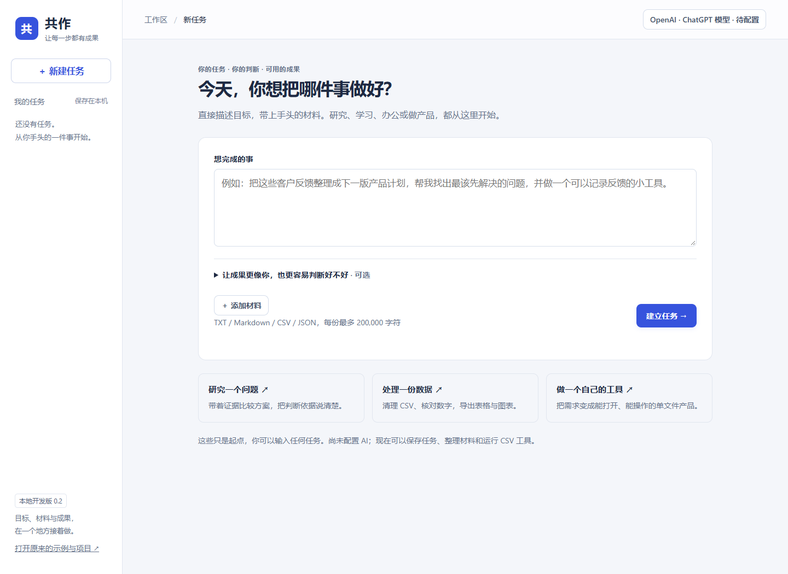

<div align="center">


# 共作 · Gongzuo

**更少消耗，更快完成，保留你的特点。**

面向普通人的开源 AI 任务工作台。把目标、材料、个人要求和成果放在一起，
以更少返工和总 token 消耗，完成真正能用的工作。

[English](README.en.md) · [快速开始](#快速开始) · [使用说明](docs/guide.md) · [真实测试](docs/benchmark.md) · [路线图](docs/roadmap.md)

[](https://github.com/liruoshui-com/gongzuo/actions/workflows/ci.yml)
[](LICENSE)
[](package.json)
[](https://github.com/liruoshui-com/gongzuo/releases)

</div>



> **v0.3.0 · 早期预览。**新增 Agent 上下文体检，追踪要求遗漏与重复读取，并支持固定重要要求。多家模型接入、任务执行和成果交付通过模拟协议与浏览器测试。已完成 DeepSeek 小样本上下文策略对照，结果有增有减，**不承诺普遍节省比例或自动达到质量标准**。上图是实际界面，不是 AI 完成任务的效果证明。

## 为什么做共作

同样使用 AI，有经验的人往往更清楚该提供哪些信息、怎么拆任务、何时用工具，以及怎样判断成果能不能用。普通用户则容易反复补背景、重做整份成果，花掉更多时间和 token。

共作希望把这些工作方法放进任务流程，让你少操心提示词，更多地决定**要做什么、什么算好，以及哪些特点属于你**。

项目的目标是：**在质量和个人特点得到保留的前提下，降低完成一个真实任务的总消耗。**

## 从哪里减少浪费

| 工作方式 | 0.3 已实现 | 还需要验证或补齐 |
| --- | --- | --- |
| 只提供当前需要的信息 | 先传材料目录，工具按需读取文本片段 | 单次执行仍会累积上下文，尚无自动压缩和重复读取去重 |
| 确定的事情交给程序 | CSV 清洗、缺失检查、分组汇总和图表可在本机完成，0 次模型调用 | 原生 Excel / Word / PDF 支持 |
| 保留你的要求，减少反复交代 | 目标、个人要求、验收条件及最近 12 条反馈传入执行；重要要求可固定 | 尚无跨任务的偏好学习；是否落实仍需检查 |
| 查清信息在哪里断了 | 本地预检、逐请求记录、早期反馈遗漏提醒、文件读取范围与重叠统计 | 包含信息不能证明模型理解；不会自动判断遗忘或压缩上下文 |
| 在已有成果上继续 | 成果可读取、保留版本，反馈后继续执行 | 尚无补丁式编辑工具，模型交付仍是完整文件 |
| 看清所有调用 | 逐请求记录返回用量、暂停执行、调用上限和 token 软上限 | 已有小样本策略对照，尚未证明合格流程节省；软上限不能撤销已计费请求 |

## 可以怎样用

- **研究与写作：**带着材料比较方案、形成文档，保留依据和表达要求。OpenAI 官方接口可选联网搜索。
- **办公处理：**上传 CSV，清理数据、核对汇总，下载可继续编辑的表格与图表。没有 API 也能试。
- **做自己的工具：**描述需求和风格，生成单文件 HTML，隔离试用、保留版本，再下载离线使用。

这些是任务起点。你可以自由描述目标，当前执行范围由已接入的工具决定。

## 快速开始

需要 **Node.js 22 或更新版本**。应用运行无第三方包依赖。

```bash
git clone https://github.com/liruoshui-com/gongzuo.git
cd gongzuo
npm start
```

打开 **http://127.0.0.1:4318**。Windows 也可以双击 `启动共作.cmd`。工作区依赖本地服务，请勿直接打开 `dist/index.html`。

默认端口被系统保留时会尝试切换到 14318，请以启动窗口显示的地址为准。

### 接入模型：选择服务 → 粘贴密钥 → 保存

支持 **DeepSeek、OpenAI（ChatGPT 系列模型）、智谱 GLM、Claude**。接口和模型已预填，各家密钥分别保存，支持切换。高级设置可换模型、改接口地址、设置调用上限，或接入兼容的本机模型。

需要各家的 **API Key**；网页会员不自动等于 API 额度。保存配置不会请求模型，「测试已保存连接」会产生少量实际用量，并单独保留记录。

### 没有 API，先试一次本地任务

1. 新建任务，上传 [`examples/团队工时.csv`](examples/团队工时.csv)（虚构示例）。
2. 在「材料」点击「本地处理 CSV」。
3. 勾选删除重复，分组填 `部门`，汇总填 `工时`。
4. 检查成果：保留 4 条记录，产品 5、研发 4、设计 2，总工时 11。

原始材料保留，生成清洗表、检查记录、分组表和 SVG 图表；模型调用为 0。

### Agent 上下文体检：查看 AI 每次实际带了哪些信息

打开任务里的「上下文体检」，先看「下次执行检查」。不用密钥，也不会请求模型。

- 查看目标、个人要求、验收条件和固定要求是否进入下一轮起始信息。
- 超过 12 条补充时，指出哪些较早内容未带入；可以把重要约束固定到后续请求中。
- 执行后回看每次请求：材料仅在目录中，还是已经带入正文片段；CSV 本地处理只算收到摘要。
- 查看同一内容版本的重叠读取字符数和服务商实际返回的 token；两者分别展示。
- 要求已传入却未遵守时，手动标记，并导出不含请求正文的诊断 JSON。

体检记录的是应用准备发送的输入，不能证明模型理解、服务端保留或成果达标。固定要求会增加后续输入长度，请保留简短且重要的约束。详见 [体检口径与限制](docs/guide.md#上下文体检)。

## 数据与当前边界

- 任务和原始材料保存在本机 `.local-data/`。**API 密钥以明文保存在本机配置文件**，目录已被 Git 忽略；密钥不进入任务导出或模型上下文。
- 点击 AI 执行后，目标、个人要求和按需读取的材料会发送到所选服务。联网搜索需要单独启用。
- 服务只监听本机，适用于单用户本地使用。没有公网登录、云同步或多人权限功能；请勿直接开放到公网。
- 输入支持 UTF-8 文本、Markdown、CSV、JSON。输出支持文本、Markdown、CSV、JSON、SVG 和自包含 HTML。
- 原生办公文件、任意代码执行、外部软件操作、多模型自动分工、数据导入与归档仍未实现。
- CSV 使用浮点运算；HTML 加载成功和文件格式通过，都不等于事实正确或产品功能达标。成果需要实际检查。

完整限制、备份方式、预览数据和用量口径见 [使用说明](docs/guide.md)。

## 如何证明更快、更省、更好

我们计划在同一模型、同等材料和工具条件下，对比普通聊天、固定专业提示词和共作。记录从第一次请求到成果合格的**全部尝试**，包括澄清、检查、失败和返工。

重点指标是合格率、个人要求落实情况、总耗时，以及 **全部尝试的 token 总和 ÷ 合格任务数**。节省不能建立在降低成果质量的基础上。

2026-09-13 已完成 DeepSeek 官方接口的小样本策略测试：CSV 按需组总 token 少 16.7%，研究任务反而多 2.9%，产品少 3.0% 但耗时增加 24.0%。存在轮次与软限停止、来源措辞及产品边界问题，不能视作同等质量下的普遍节省。56 次请求（含连接检查与补跑）累计 237,858 token，按当日价格估算约 0.19 元。详见 [真实数据、失败原因与竞品证据](docs/benchmark.md) 及 [复现方法](benchmarks/README.md)。

## 开发与参与

```bash
npm run check
npm test
```

后台测试使用隔离的本地模拟服务，不需要 API 密钥。GitHub Actions 在 Windows / Linux、Node.js 22 / 24 上运行。浏览器验收方式见 [CONTRIBUTING.md](CONTRIBUTING.md)。

```text
dist/          任务工作区与保留的第一版示例
lib/           模型适配、执行器、CSV、存储与预览
server.mjs     本地 API 与页面服务
tests/         协议、故障、存储和浏览器测试
docs/          使用说明、验证方案与路线图
benchmarks/    合成任务、实际对照、结构检查与公开测量记录
```

最欢迎的贡献是：**能复现的真实任务、失败案例、减少无效输入的方法，以及保留个人特点的验收条件。**提交 issue 时请使用脱敏材料，不要包含 API 密钥。

以 [MIT](LICENSE) 许可证发布。
